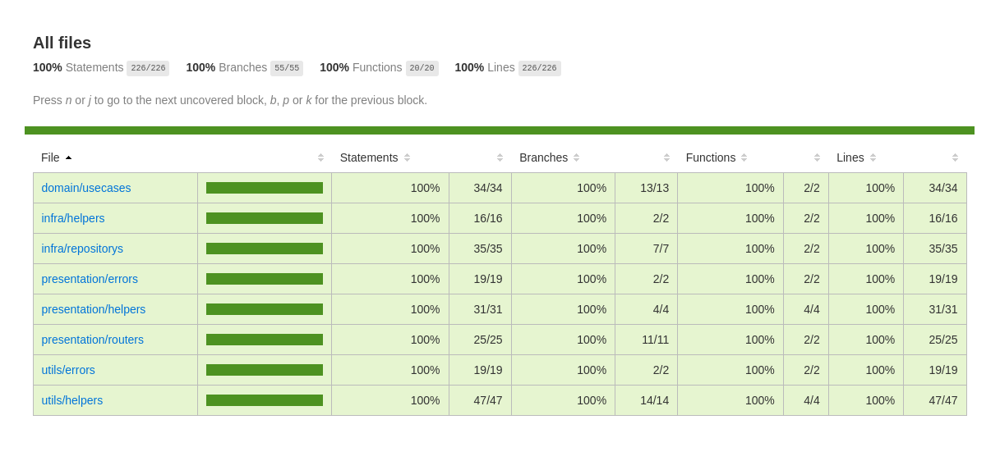

 
 

  

<h2 align="center">Node.js API with Clean Architecture</h2>
  

    This repository isn't a real API! It's only a study about TDD and Clean Architecture. If you want to know more about this type of content, the <b>FREE</b> course access is in the link bellow. This project was created with 100% of coverage, as you can see in the image above. The only layer with no full coverage is Main, but it was used only for creating the instances and all the files are attached into other layers. The name of the tests files aren't the default extensions, but I created they with this names to make it more simple to understand what type of test is. If you feel weird about the tests without the beautiful icons, you can configure your text editor with the new test extensions and your problem will be solved.
     
     
    <a href="https://youtube.com/playlist?list=PL9aKtVrF05DyEwK5kdvzrYXFdpZfj1dsG"><strong>Watch the course »</strong></a>
     
     
    <a href="https://br.linkedin.com/in/matheus-alvarenga-de-oliveira">My LinkedIn Profile</a>
    ·
    <a href="https://github.com/matheusAlvarenga">My Github Profile</a>

 

 

> ## Available Commands

In the project directory, you can run:

### `yarn test:unit`

This command is used for run the jest testing for unit tests.

### `yarn test:int`

This command is used for run the jest testing for integration tests.

### `yarn test:ci`

This command is used for run all tests and generate the coverage.

 

> ## Design Patterns

* Factory
* Adapter
* Dependency Injection
* Composition Root

> ## Methodologies and Designs

* TDD
* Clean Architecture
* Use Cases

> ## Libraries and Tools

* Jest
* SuperTest
* Git
* NPM
* Husky
* Lint Staged
* Eslint
* Bcrypt
* JWT

> ## 🤝 Support

Give a ⭐️ if you like this project!
